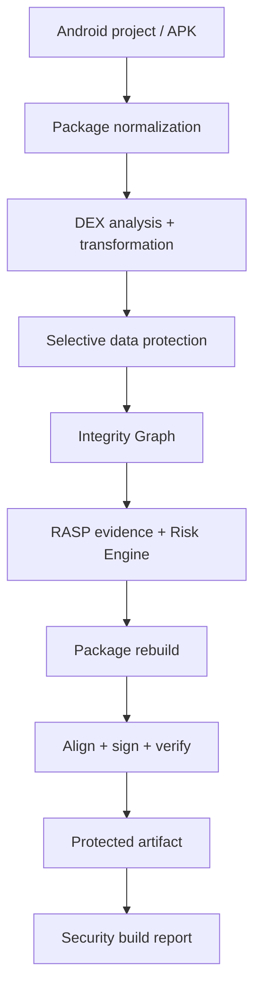

<div align="center">

# Nexora Shield

### Defense-in-depth Android application protection

A modular Android hardening platform designed to raise the cost of reverse engineering, tampering, repackaging, runtime instrumentation, and extraction of sensitive application logic.

[](https://github.com/Gh0stDeveloper/Nexora-Shield/actions/workflows/ci.yml)


[Vision](docs/VISION.md) · [Architecture](docs/ARCHITECTURE.md) · [Threat Model](docs/THREAT-MODEL.md) · [Security Design](docs/SECURITY-DESIGN.md) · [Configuration](docs/CONFIGURATION.md) · [Testing](docs/TESTING.md) · [Production Audit](docs/PRODUCTION-READINESS-AUDIT.md) · [Phase O](docs/PHASE-O.md) · [Release Process](docs/RELEASE-PROCESS.md) · [Roadmap](docs/ROADMAP.md) · [Security Policy](SECURITY.md)

</div>

---

## Overview

**Nexora Shield** is an Android application-protection platform built around layered defensive controls rather than a single obfuscation pass.

Its goal is not to claim that protected software is "unbreakable". Software executing on an attacker-controlled device can ultimately be inspected. The objective is to make analysis and modification substantially more expensive, reduce reusable bypasses, detect defined integrity violations, and keep defensive behavior measurable through repeatable tests.

The component roadmap through **Phase N — Production Hardening** is complete, but a stricter post-N production audit found release-blocking integration and governance gaps. **Phase O — Production Release Audit & Hardening is open and `v1.0.0` is intentionally blocked.**

The most important open item is the production protection path: the current user-facing `nexora-shield protect` command still reaches the Phase A packaging pipeline and does not yet prove end-to-end orchestration of all documented B–I protection engines into the final artifact. See the [Production Readiness Audit](docs/PRODUCTION-READINESS-AUDIT.md).

| Area | Current state |
| --- | --- |
| Workspace version | **1.0.0** |
| Rust MSRV | **1.81** |
| Foundation | Completed |
| APK packaging pipeline | Completed |
| DEX engine | Completed |
| Data protection | Completed |
| Integrity / anti-tamper | Completed |
| RASP / risk engine | Completed |
| Native Shield | Completed |
| VM Shield | Completed |
| Per-Build Diversification | Completed |
| Attestation & Remote Policy | Completed |
| Gradle Plugin component | Completed; production orchestration pending O.1 |
| AAB / AAR / Splits compatibility foundation | Completed; final-artifact protection proof pending O.3/O.4 |
| Shield Studio component | Completed; signed/notarized distribution pending O.7 |
| Security Lab | Completed; coverage-guided fuzzing expansion pending O.9 |
| Production hardening / Phase N | Completed within Phase N scope |
| Production release audit / Phase O | **OPEN — O.0 freeze implemented; remediation continues** |
| Stable 1.0 | **NO-GO until Phase O closes** |

## Implemented Protection Layers

### Core packaging

The packaging layer provides the reproducible foundation used by later protection stages:

- APK/ZIP normalization;
- Android manifest inspection;
- multi-DEX discovery;
- deterministic build planning;
- transactional protection pipeline;
- public/private build reports;
- `zipalign` and `apksigner` integration;
- inspect, protect, and verify CLI workflows.

### DEX engine

The DEX subsystem provides structured analysis and rewriting instead of byte-level blind patching:

- DEX parsing and writing;
- validation and round-trip tests;
- control-flow graph analysis;
- type analysis;
- SSA/IR foundations;
- reference graph construction;
- selector resolution;
- compatible renaming;
- metadata reduction;
- reflection/JNI compatibility analysis;
- multidex rewriting.

### Data protection

Sensitive application data can be selected and protected using authenticated containers and per-build material:

- sensitive-string classification;
- authenticated encrypted containers;
- per-build key derivation;
- decrypt-on-use runtime model;
- constant protection;
- selected resource protection;
- caching/lifetime policies;
- private protection metadata;
- exposure and overhead benchmarks.

### Integrity / anti-tamper

Phase D adds distributed integrity evidence across multiple application surfaces:

- certificate binding;
- package identity checks;
- DEX region integrity;
- resource integrity;
- native-library integrity;
- deterministic Integrity Graph;
- distributed checks;
- typed response API;
- re-signing regression tests;
- patch/repack regression tests.

### RASP and risk engine

Phase E adds runtime evidence collection and policy-driven decisions.

Current signal families include:

- debugger/JDWP evidence;
- runtime instrumentation evidence;
- hook and injection evidence;
- writable/executable mapping evidence;
- code-page mismatch evidence;
- modified-system evidence;
- bootloader / verified-boot / SELinux evidence;
- root-management and privileged-binary artifacts;
- emulator and hypervisor evidence;
- Phase D integrity verdict fusion.

Signals are correlated by a deterministic weighted **Risk Engine**. Policies are compiled and validated before use, and response severity is monotonic.

Supported response classes include:

- continue;
- report;
- require re-verification;
- deny a sensitive operation.

A dedicated **report-only mode** keeps detection observable without enforcing blocking decisions, which is useful during rollout and false-positive tuning.

## Architecture

> The diagram below is the **target production architecture**. Phase O exists specifically to ensure the real CLI/Gradle/Studio production path executes this stage chain end-to-end before stable publication.



The architecture is intentionally modular so packaging, DEX, data protection, integrity, RASP, native hardening, VM protection, diversification, attestation, Gradle integration, Shield Studio and Security Lab can evolve without duplicating protection semantics.

## Rust Workspace

The current workspace contains:

| Crate | Responsibility |
| --- | --- |
| `shield-core` | Build plan, orchestration, reports, and pipeline contracts |
| `shield-package` | APK/ZIP normalization and Android package handling |
| `shield-dex` | DEX parser, IR/analysis, selectors, and rewrite passes |
| `shield-crypto` | Cryptographic containers, derivation, and protected data |
| `shield-integrity` | Certificate/package/content integrity and Integrity Graph |
| `shield-rasp` | Runtime signals, risk scoring, policy compilation, and responses |
| `shield-native` | Native runtime helpers and Android ABI hardening |
| `shield-vm` | Selective VM Shield and execution model |
| `shield-diversity` | Per-build diversification and portability regression |
| `shield-attestation` | Optional attestation and remote-policy contracts |
| `shield-lab` | Security Lab corpus, fuzz, tamper and release regressions |
| `shield-release` | 1.0 API/schema/release qualification contracts |
| `shield-cli` | Command-line interface |

The Gradle Plugin and Shield Studio remain separate JVM/Compose projects that consume the same protection contracts.

## Security Principles

Nexora Shield follows several design rules:

1. **Defense in depth** — no individual layer is treated as sufficient.
2. **Selective hardening** — expensive protections are reserved for high-value surfaces.
3. **Per-build diversity** — reusable signatures and fixed bypasses should become less effective across builds.
4. **Fail-safe behavior** — compatibility failures must not silently create false confidence.
5. **Measured security** — protection changes require tests and adversarial regression evidence.
6. **No secret-in-APK fallacy** — high-value secrets are not considered secure merely because they are encrypted inside an APK.
7. **Evidence correlation** — runtime decisions are based on multiple signals rather than a single binary check.
8. **Update resilience** — internal implementation changes should not destabilize public configuration contracts.

## Protection Profiles

The configuration model is designed around three protection levels:

| Profile | Intended use |
| --- | --- |
| **Standard** | Lower-overhead protection for broad application coverage |
| **Hardened** | Stronger data, integrity, and runtime controls for sensitive applications |
| **Maximum** | Selective high-cost protection for critical surfaces where additional overhead is acceptable |

Maximum protection is intentionally not the default for an entire application.

## CLI Direction

The CLI is the primary automation surface.

```bash
nexora-shield protect app.apk --output app-protected.apk --profile hardened
nexora-shield inspect app-protected.apk
nexora-shield verify app-protected.apk
nexora-shield retrace --mapping mapping.nshield crash.txt
```

For development and validation:

```bash
cargo build --workspace
cargo test --workspace
cargo clippy --workspace --all-targets --all-features
```

## CI and Validation

The GitHub Actions pipeline validates the project continuously with gates covering:

- Rust formatting and linting;
- workspace tests;
- dependency/security auditing;
- Rust 1.81 MSRV compatibility;
- APK packaging and signing regression;
- DEX round-trip and transformation regression;
- protected-data tamper rejection;
- integrity / re-sign / patch / repack tests;
- RASP signal, risk-engine, policy, response, and false-positive regression tests.

A phase is only considered complete when its implementation, tests, documentation, CI evidence, and exit criteria are all satisfied.

## Roadmap

| Phase | Scope | Status |
| --- | --- | --- |
| **0** | Foundation / threat model / architecture | ✅ Complete |
| **A** | Core packaging | ✅ Complete |
| **B** | DEX engine | ✅ Complete |
| **C** | Data protection | ✅ Complete |
| **D** | Integrity / anti-tamper | ✅ Complete |
| **E** | RASP / risk engine | ✅ Complete |
| **F** | Native Shield | ✅ Complete |
| **G** | VM Shield | ✅ Complete |
| **H** | Per-build diversification | ✅ Complete |
| **I** | Attestation / remote policy | ✅ Complete |
| **J** | Gradle Plugin component | ✅ Complete |
| **K** | AAB / AAR / splits compatibility foundation | ✅ Complete |
| **L** | Shield Studio | ✅ Complete |
| **M** | Security Lab | ✅ Complete |
| **N** | Production hardening / 1.0 qualification | ✅ Complete in N scope |
| **O** | Production release audit & hardening | 🚧 **Open — release blocking** |

See [docs/ROADMAP.md](docs/ROADMAP.md) for the complete exit criteria and subphases.

## Documentation

- [Architecture](docs/ARCHITECTURE.md)
- [APK Packaging](docs/APK-PACKAGING.md)
- [Threat Model](docs/THREAT-MODEL.md)
- [Security Design](docs/SECURITY-DESIGN.md)
- [Configuration](docs/CONFIGURATION.md)
- [Testing Strategy](docs/TESTING.md)
- [Phase E — RASP](docs/PHASE-E.md)
- [Phase E Checklist](docs/PHASE-E-CHECKLIST.md)
- [CI](docs/CI.md)
- [Roadmap](docs/ROADMAP.md)
- [Production Readiness Audit](docs/PRODUCTION-READINESS-AUDIT.md)
- [Phase O — Production Release Audit & Hardening](docs/PHASE-O.md)
- [Phase O Checklist](docs/PHASE-O-CHECKLIST.md)
- [Phase O.0 Baseline](docs/PHASE-O0-BASELINE.md)
- [Phase O Accepted Risk Policy](docs/PHASE-O-ACCEPTED-RISK.md)
- [Contributing](CONTRIBUTING.md)
- [Security Policy](SECURITY.md)

## Responsible Use

Nexora Shield is intended to protect software you own or are explicitly authorized to protect.

The project is not intended to provide malware persistence, hide malicious payloads, exploit devices, or bypass platform security controls for unauthorized purposes.

## License

A final repository license has not yet been selected.

---

<div align="center">

**Nexora Shield — measurable Android hardening through layered defensive engineering.**

</div>
